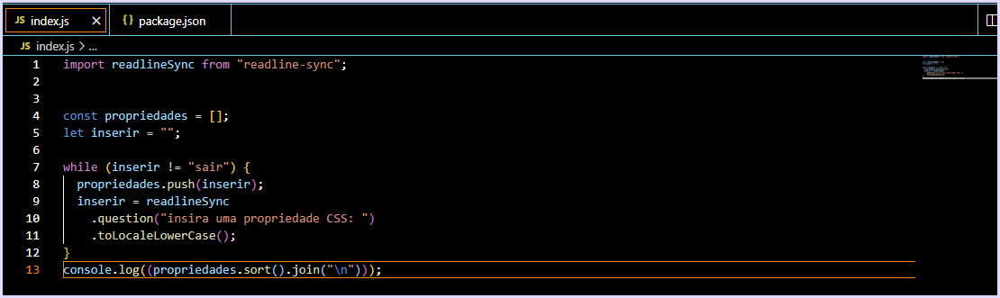
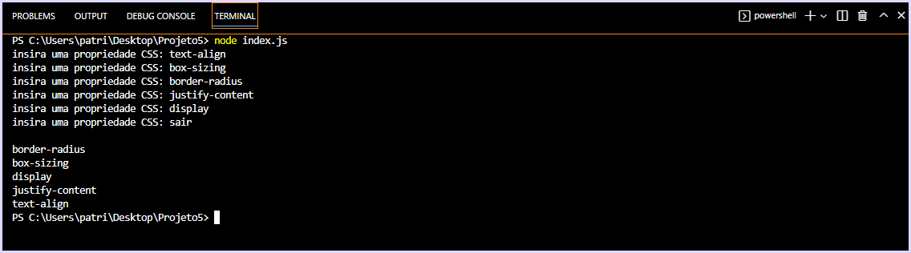

# Projeto Individual, Módulo 5, Facilitando a vida🧑🏾‍💻.

<h2>Neste projeto, utilizei somente a linguagem: 
</h2>

&nbsp;

<h2>A proposta é de usar o Node para montar um codigo que recebe uma lista de propriedades CSS, (ex: text-align, background-color, font-size) e devolver uma lista ordenada de A-Z. Ordenar o CSS auxilia a encontrar mais rápido a propriedade que iremos alterar.

Fiz este Projeto na sala de aula do curso da RESILIA em conjunto com o SENAC, PROGRAMADORES CARIOCAS, foi um trabalho individual, que após entregue, venho frequentemente aperfeiçoando o mesmo, visando meu desenvolvimento profissional.</h2>

<h1> O código: </h1>

<h1> A saída no console: </h1>

<h2> Espero que gostem! :) </h2>
